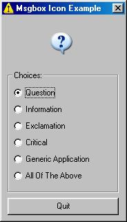

<div align="center">

## Msgbox API Icons


</div>

### Description

This code shows how to display the msgbox icons on your form. No Icons to include in your project, no picture controls, only API. UPDATED 12/22/06 - Simplified the little bit of code that was there and added an additional icon. If you like, please vote. Thanks!
 
### More Info
 


<span>             |<span>
---                |---
**Submitted On**   |2005-05-06 13:10:16
**By**             |[Kelley Hendrix](https://github.com/Planet-Source-Code/PSCIndex/blob/master/ByAuthor/kelley-hendrix.md)
**Level**          |Beginner
**User Rating**    |4.8 (19 globes from 4 users)
**Compatibility**  |VB 6\.0
**Category**       |[Miscellaneous](https://github.com/Planet-Source-Code/PSCIndex/blob/master/ByCategory/miscellaneous__1-1.md)
**World**          |[Visual Basic](https://github.com/Planet-Source-Code/PSCIndex/blob/master/ByWorld/visual-basic.md)
**Archive File**   |[Msgbox\_API188527562005\.zip](https://github.com/Planet-Source-Code/kelley-hendrix-msgbox-api-icons__1-60395/archive/master.zip)

### API Declarations

```
Public Declare Function LoadStandardIcon Lib "user32" Alias _
 "LoadIconA" (ByVal hInstance As Long, ByVal lpIconNum As _
 MsgPicTypes) As Long
Public Declare Function DrawIcon Lib "user32" (ByVal hDC _
 As Long, ByVal x As Long, ByVal y As Long, _
 ByVal hIcon As Long) As Long
```


